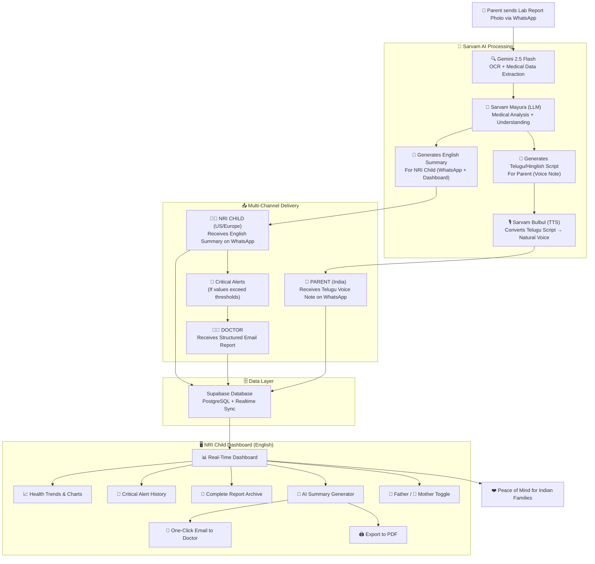

# Dear Comrade (డియర్ కామ్రేడ్ / डियर कॉमरेड)

> **A smart, zero-friction health link for NRI children and their parents back home, powered by Sarvam AI.**

Dear Comrade is an event-driven medical intelligence pipeline that bridges dense clinical data with non-tech-savvy aging parents in India. By leveraging Sarvam’s state-of-the-art Indic language models, we transform intimidating lab reports into warm, conversational, and personalized voice notes in native languages.

---
## Architecture Diagram


## 🎥 Demo Video

Let's see dear comrade in Action

[(Video Link)](https://x.com/vishalsingh2972/status/2065684282203644147?s=20)

---
## 📝 Blog Post

[Link to blog post](https://docs.google.com/document/d/1uOwlQk6d7ZD5ZJ4lWFOYHA4dUwRsCN5Z/edit?usp=sharing&ouid=113001867272048306232&rtpof=true&sd=true)

---
## 📌 Project Overview

When a parent photographs a physical lab report via standard **WhatsApp**, the system intercepts the media payload and forks into a split-target delivery pipeline:

1. **To Parent (Immediate & Interactive):** Delivers a permanent, personalized WhatsApp audio note using warm, conversational, code-mixed native syntax (**Telugish / Hinglish**) generated via **Sarvam AI**.
2. **To NRI Child (One-Time & Informational):** Delivers an English medical executive summary on WhatsApp and updates a unified web dashboard.
3. **Critical Alert Tier (Clinical Escalation):** If extracted medical metrics exceed safe clinical thresholds, the system bypasses standard routines to trigger an **Immediate Urgent Alert** to the child’s WhatsApp AND an **automated email dispatch to the family doctor** ensuring rapid medical intervention.
4. **Daily Routine Layer (Parent Only):** Every morning at 8:00 AM IST, a background cron engine dispatches tailored lifestyle and hydration reminders exclusively to the parent based on their extracted anomalies—keeping the child's inbox clear.

**Dear Comrade** is an event-driven asynchronous pipeline that bridges dense clinical data with non-tech-savvy aging parents in India.

---

## 👩‍💼 Real-World Example: Sudha (Texas) & Her Father (Hyderabad)

> “Sudha is in Texas working long hours, constantly worrying about her elderly father living alone in Hyderabad. Her father returns from a clinic with a complex 3-page medical report full of intimidating metrics like *HbA1c* and *Serum Creatinine*.
> Instead of facing a confusing patient portal, he takes a quick photo of the paper on WhatsApp and sends it to **Dear Comrade**.
> Within 90 seconds, he receives a WhatsApp message with a permanent voice note. A natural, local Telugu voice explains: *'Namaste andi. Mee blood report nenu chasanu. Mee Sugar levels control lone unnay, kani mee Creatinine level 1.4 koncham high undi. Doctor garu cheppinattu roju manchi ga neellu thagandi.'*
> At that exact same second, Sudha's phone in Texas buzzes with an English summary on WhatsApp. She opens her **Next.js Web Dashboard** to view digitized time-series trends over the last 6 months.
> *Scenario B (Critical):* If the report shows dangerous blood sugar levels, the system alerts Sudha immediately via WhatsApp AND sends an urgent clinical summary email to the family doctor with a secure link to the report dashboard.
> From that day onward, every morning at 8:00 AM IST, her father gets his custom audio reminder on WhatsApp. Sudha receives zero daily notification spam, keeping her high-priority inbox entirely clutter-free, leaving both of them tension-free, and seamlessly in sync with each other on a day-to-day basis.”

---

## 💭 The Problem Space

For many NRI professionals living in the US or Europe, managing the medical workflows of aging parents presents major obstacles:

* **Cognitive Friction:** Elderly parents are overwhelmed by dense clinical ranges, causing severe text-retention and health anxiety.
* **Linguistic Rigidness:** Standard LLM translation models use stiff, dictionary-formal translations that sound robotic and fail at conversational "code-mixing" (Hinglish/Telugish).
* **Voice Ephemerality:** Automated calls are fleeting; once the line hangs up, elderly patients cannot re-listen to critical diagnostic instructions.
* **Webhook Timeouts:** Multi-modal extraction, code-mixed translation, and speech synthesis are highly intensive. Handling this synchronously causes HTTP gateway timeouts.

---

## 🧠 Core System Processing Lifecycle

```txt
[Parent WhatsApp Image Upload] ──> [Twilio Messaging API] ──> (Fast HTTP ACK 200) ──> [NestJS Gateway]
                                                                                               │
                                                                                    (Microservice Enqueue)
                                                                                               ▼
                                                                                    [BullMQ + Redis Queue]
                                                                                               │
                                   ┌───────────────────────────────────────────────────────────┴──────────────────────────────────────────────────────────┐
                                   ▼ (Async Worker Thread)                                                                                                ▼
                         [Gemini 2.5 Flash Vision]                                                                                         [Pre-Flight Validation]
                        (Strict JSON Schema Extract)                                                                                       (If Unreadable)
                                   │                                                                                                             │
                                   ▼                                                                                                             ▼
                         [Sarvam AI Pipeline]                                                                                          [Immediate Error Dispatch]
                     (Mayura Script + Bulbul TTS)
                                   │
                         [Cloudinary CDN Streaming]
                       (Secure Permanent Media URL)
                                   │
                         [Supabase / PostgreSQL]
                           (Time-Series State)
                                   │
                  ┌────────────────┴────────────────┐
                  ▼ (Postgres Realtime)             ▼ (Criticality Check)
        [Next.js 15 UI Dashboard]          [Logic: Critical vs. Normal]
       (Instant Recharts Rendering)                  │
                          ┌──────────────────────────┴──────────────────────────┐
                          ▼                                                     ▼
              [Standard Dispatch Engine]                             [Urgent Escalation Engine]
                          │                                                     │
                          │                                         ┌───────────┴───────────┐
                          │                                         ▼                       ▼
              [To NRI Child via WhatsApp]                [To NRI Child WhatsApp]    [To Doctor via Resend]
             • English Clinical Summary.               • Emergency Notification.   • Clinical Summary + 
                                                                                   Secure Dashboard Link.

```

---

## 🛠️ Tech Stack & Engineering Rationale

| Architecture Layer | Technology | Engineering Selection Reason |
| --- | --- | --- |
| **Monorepo Orchestrator** | **Turborepo** | Enforces a unified TypeScript workspace. |
| **Frontend Platform** | **Next.js 15** | Powers the tracking interface with Server Actions. |
| **Enterprise Backend** | **NestJS 10+** | Solid dependency-injected framework. |
| **Async Task Manager** | **BullMQ + Redis** | Offloads intensive AI/TTS tasks to background threads. |
| **Messaging & Voice** | **Twilio API** | Industry-standard reliability for WhatsApp. |
| **Email Escalation** | **Resend** | Secure, developer-focused API for critical clinical alerts. |
| **Media Hosting** | **Cloudinary** | Provides WhatsApp-trusted, secure media URLs. |
| **Sovereign Speech AI** | **Sarvam AI** | Regional language mastery and natural TTS. |
| **Inference Framework** | **Gemini 2.5 Flash** | Deterministic structured JSON output. |
| **Database & Security** | **Supabase (PostgreSQL)** | Relational time-series data with RLS security. |

---

## 📋 Telephony & State Machine Logic

* **`MEDIA_INGESTED`**: Capture Twilio inbound WhatsApp media webhooks.
* **`METRIC_EXTRACTED`**: Invoke Gemini Flash to map medical values into objects.
* **`CRITICALITY_CHECK`**: If `severity_level` is CRITICAL, initiate two-way escalation: notify the NRI child via WhatsApp and dispatch a clinical alert email to the family doctor via **Resend**.
* **`SCRIPT_LOCALIZED`**: Use **Sarvam Mayura** to transform clinical data into conversational, native script.
* **`AUDIO_STREAMED`**: Use **Sarvam Bulbul V3** for natural TTS.
* **`CLOUD_PERSISTED`**: Stream audio to **Cloudinary** for permanent URL access.
* **`LEDGER_PERSISTED`**: Commit to PostgreSQL; triggers real-time data sync for the Dashboard.
* **`PIPELINE_RESOLVED`**: Execute structured multi-channel delivery.
* **`CRON_RECURRING_FIRED`**: Batch process personalized habit reminders for parents.

---

## 🚀 What I Learned from this Project

- Building "Dear Comrade" was my first time actually shipping a production-ready AI voice app. It taught me that moving from an "idea" to a working prototype involves much more than just writing code; it’s about managing the flow between different AI engines.
- I learned how to stitch together complex pieces—Twilio for the telephony, Gemini for the brain, and Sarvam AI for the voice—into one smooth, reliable pipeline.
- Working with Telugu and "Tenglish" was a massive eye-opener. I had to learn how to handle code-mixing and ensure the AI didn't sound like a robot, which gave me a much deeper appreciation for building multilingual systems for real Indian users.
- I spent a lot of time getting comfortable with event-driven architecture. Using BullMQ and Redis to handle background tasks was a game-changer—it taught me how to keep a system responsive even when the AI processing takes a few seconds.
- This project really drove home the point that engineering isn't just about the tech. In healthcare, the "how" matters just as much as the "what." If the delivery isn't empathetic or clear, the data is useless, and I learned to prioritize that human touch in my design.
- Taking this from a concept in my head to a full-stack, functional product was a rewarding journey. It gave me real hands-on experience in how to architect, debug, and deploy an AI-first application.
- I look forward to exploring and working more closely with audio LLMs in my upcoming projects.
---